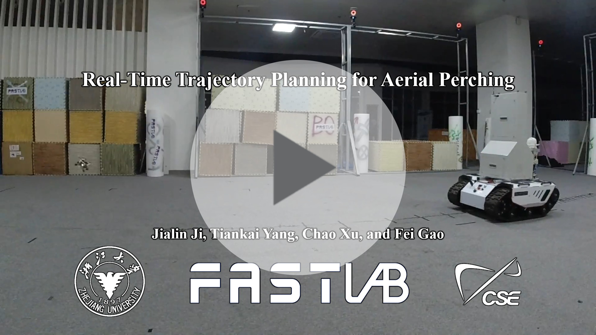
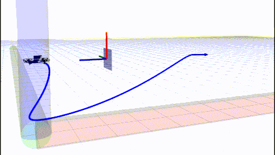
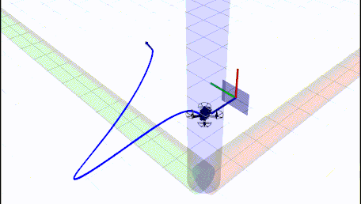
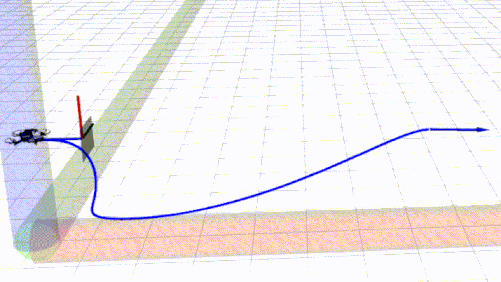
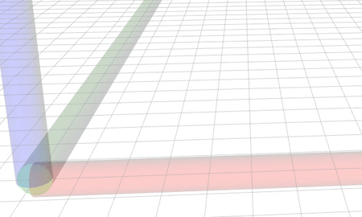

# Fast-Perching

## 0. Overview
**Fast-Perching** presents a novel trajectory planning method for real-time aerial perching, which adaptively adjusts terminal states and the trajectory duration. This feature is especially notable on micro aerial robots with low maneuverability or scenarios where the space is not enough.

**Authors**: Jialin Ji, Tiankai Yang and [Fei Gao](https://ustfei.com/) from the [ZJU Fast Lab](http://zju-fast.com/). 

**Paper**: [Real-Time Trajectory Planning for Aerial Perching](https://arxiv.org/abs/2203.01061), Jialin Ji, Tiankai Yang, Chao Xu, Fei Gao, Accepted in IEEE/RSJ International Conference on Intelligent Robots and Systems (__IROS 2022__).

**Video Links**: [bilibili](https://www.bilibili.com/video/BV14q4y147uz)
<a href="https://www.bilibili.com/video/BV14q4y147uz" target="blank">
  <p align="center">
    
  </p>
</a>

## 1. Simulation of Aerial Perching

>Preparation and visualization:
```
git clone https://github.com/ZJU-FAST-Lab/Fast-Perching
cd Fast-Perching
catkin_make
source devel/setup.zsh
chmod +x sh_utils/pub_triger.sh
roslaunch planning perching.launch
```

>Start the perching planner:
```
./sh_utils/pub_triger.sh
```
<p align="center">
    
</p>

>Change the position, veliocity and orientation of the landing plate:
```html
<!-- DIR: src/planning/launch/perching.launch -->
  <param name="perching_px" value=""/>
  <param name="perching_py" value=""/>
  <param name="perching_pz" value=""/>
  <param name="perching_vx" value=""/>
  <param name="perching_vy" value=""/>
  <param name="perching_vz" value=""/>
  <param name="perching_axis_x" value=""/>
  <param name="perching_axis_y" value=""/>
  <param name="perching_axis_z" value=""/>
  <param name="perching_theta" value=""/>
```

<p align="center">
    
</p>

## 2. Other Settings or Functions

>Enable replan module of the planner:
```html
<!-- DIR: src/planning/launch/perching.launch -->
  <param name="replan" value="true"/>
```
<p align="center">
    
</p>

>Enable pause debug module of the planner:
```html
<!-- DIR: src/planning/launch/perching.launch -->
  <param name="pause_debug" value="true"/>
```

<p align="center">
    
</p>

## 3. Acknowledgement
We use [**MINCO**](https://github.com/ZJU-FAST-Lab/GCOPTER) as our trajectory representation.